# Flask-X-OpenAPI-Schema Documentation

## Project Overview

Flask-X-OpenAPI-Schema is a library that simplifies the generation of OpenAPI schemas from Flask-RESTful resources and Pydantic models. It provides a seamless integration between Flask, Flask-RESTful, and Pydantic, allowing developers to create well-documented APIs with minimal effort.

The library focuses on automating the process of generating OpenAPI documentation by leveraging Python type annotations and Pydantic models, while also providing support for internationalization (i18n) and file uploads.

## Core Features

- **Automatic OpenAPI Schema Generation**: Generate OpenAPI schemas from Flask-RESTful resources
- **Pydantic Integration**: Convert Pydantic models to OpenAPI schemas
- **Parameter Auto-Detection**: Automatically detect and inject request parameters from function signatures
- **Type Preservation**: Preserve type annotations from Pydantic models for better IDE support
- **Multiple Output Formats**: Output schemas in YAML or JSON format
- **Internationalization Support**: Support for i18n in API documentation
- **File Upload Handling**: Simplified handling of file uploads with automatic parameter injection

## Architecture

The following diagram illustrates the high-level architecture of Flask-X-OpenAPI-Schema:

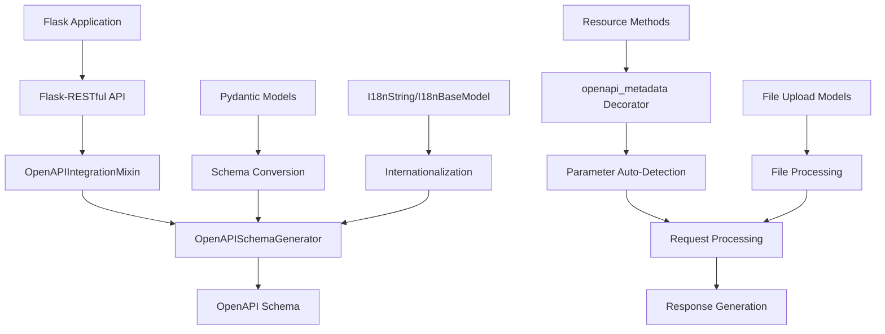

## Core Components

### 1. Decorator System

The `openapi_metadata` decorator is the primary entry point for adding OpenAPI metadata to API endpoints:

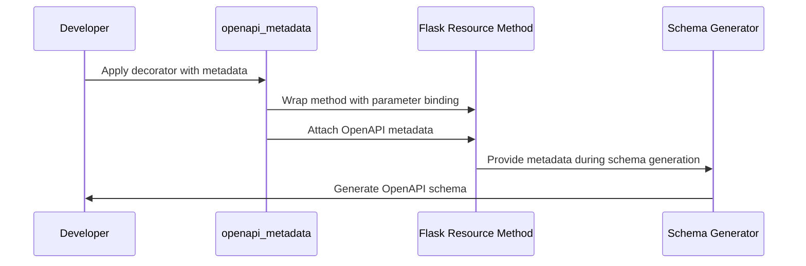

### 2. Parameter Auto-Detection

The library automatically detects parameters with special prefixes and their types:

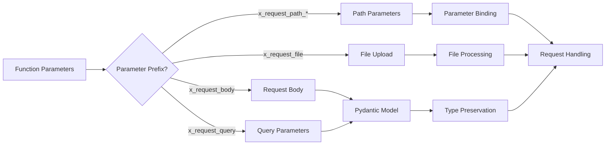

### 3. Schema Generation Process

The schema generation process involves scanning Flask blueprints and resources:

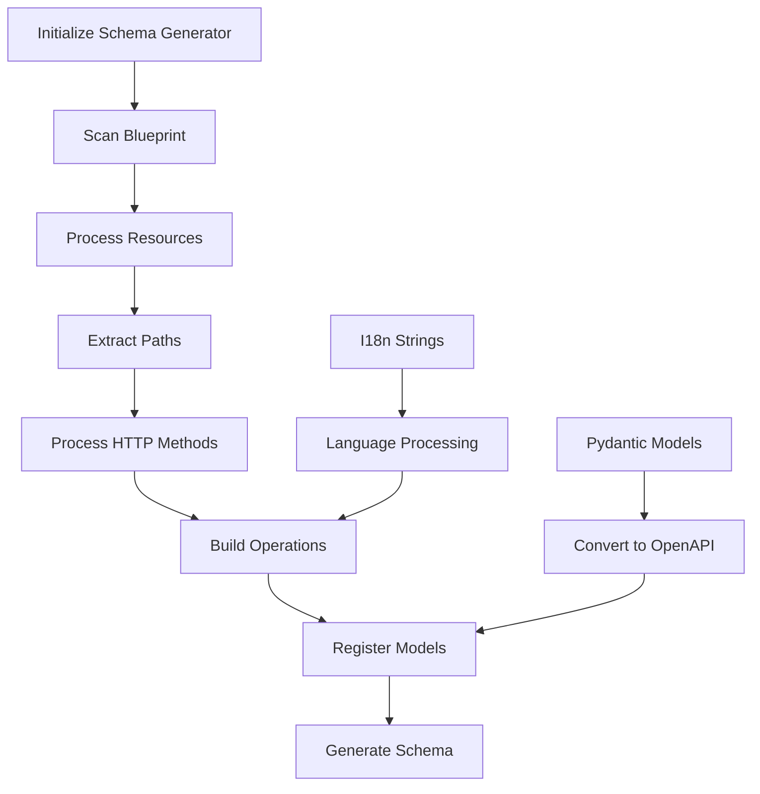

### 4. Internationalization Support

The i18n support allows for multilingual API documentation:

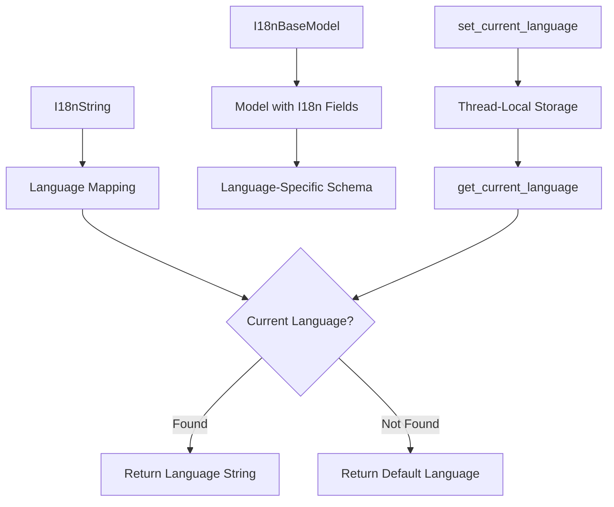

### 5. File Upload Handling

The file upload handling simplifies working with uploaded files:

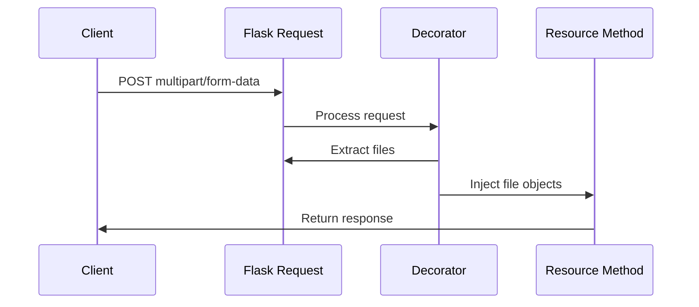

## Data Flow

The following diagram illustrates the data flow when processing an API request:

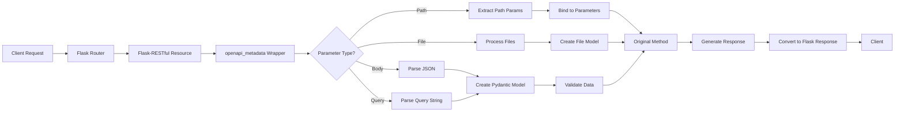

## Integration Points

Flask-X-OpenAPI-Schema integrates with several components:

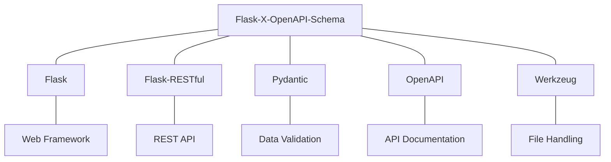

## Usage Patterns

### Basic Usage Pattern

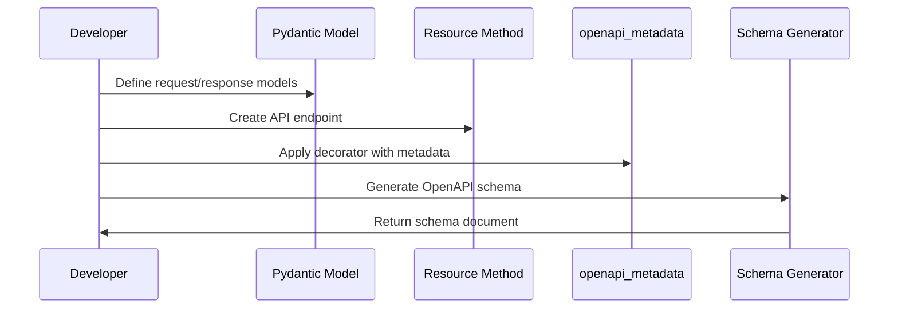

### Advanced Usage with I18n

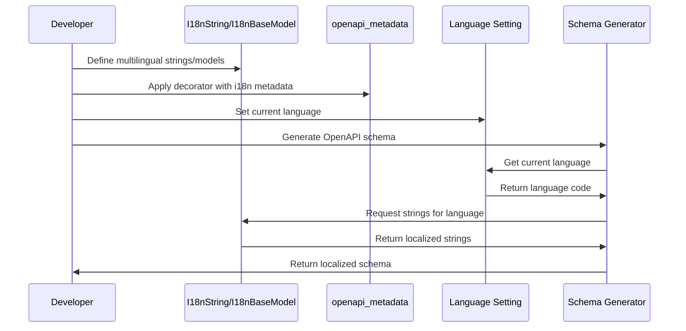

## Implementation Details

### Key Classes and Their Relationships

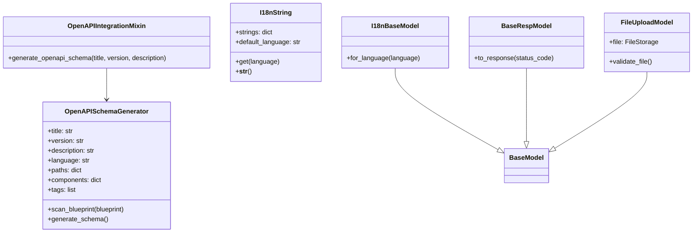

## Conclusion

Flask-X-OpenAPI-Schema provides a powerful yet easy-to-use solution for generating OpenAPI documentation from Flask-RESTful APIs. By leveraging Python type annotations and Pydantic models, it automates much of the documentation process while providing rich features like internationalization and file upload handling.

The library's architecture is designed to be flexible and extensible, allowing developers to customize the documentation generation process to suit their specific needs.