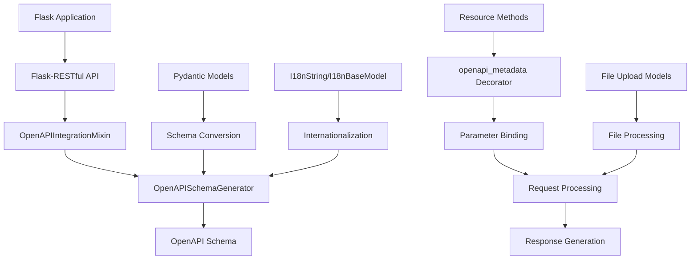

# Project Overview

## What is Flask-X-OpenAPI-Schema?

Flask-X-OpenAPI-Schema is a library that simplifies the generation of OpenAPI schemas from Flask-RESTful resources and Pydantic models. It provides a seamless integration between Flask, Flask-RESTful, and Pydantic, allowing developers to create well-documented APIs with minimal effort.

The library focuses on automating the process of generating OpenAPI documentation by leveraging Python type annotations and Pydantic models, while also providing support for internationalization (i18n) and file uploads.

## Core Features

- **Automatic OpenAPI Schema Generation**: Generate OpenAPI schemas from Flask-RESTful resources and Flask.MethodView classes
- **Pydantic Integration**: Seamlessly convert Pydantic models to OpenAPI schemas
- **Smart Parameter Handling**: Inject request parameters from Pydantic models using special prefixes
- **Type Safety**: Preserve type annotations for better IDE support and validation
- **Multiple Formats**: Output schemas in YAML or JSON format
- **Internationalization**: Built-in i18n support for API documentation
- **File Upload Support**: Simplified handling of file uploads
- **Flexible Architecture**: Optional Flask-RESTful dependency

## Architecture

The following diagram illustrates the high-level architecture of Flask-X-OpenAPI-Schema:

## Key Components

### 1. Decorator System

The `openapi_metadata` decorator is the primary entry point for adding OpenAPI metadata to API endpoints. It handles parameter detection, binding, and response conversion.

### 2. Parameter Binding

The library binds parameters with special prefixes:

- `x_request_body`: Request body from JSON
- `x_request_query`: Query parameters
- `x_request_path_<name>`: Path parameters
- `x_request_file`: File uploads

### 3. Schema Generation

The schema generation process scans Flask blueprints and resources to extract paths, methods, and operations for the OpenAPI schema.

### 4. Internationalization Support

The i18n support allows for multilingual API documentation using `I18nString` and `I18nBaseModel` classes.

### 5. File Upload Handling

The file upload handling simplifies working with uploaded files through automatic detection and validation.

## Data Flow

1. Client sends a request to a Flask endpoint
2. Flask routes the request to the appropriate resource
3. The `openapi_metadata` wrapper processes the request parameters
4. Parameters are bound to the function arguments
5. The original method is called with the processed parameters
6. The response is converted to a Flask-compatible format
7. The response is returned to the client

## Integration Points

- **Flask**: Web framework integration
- **Flask-RESTful**: REST API integration (optional)
- **Pydantic**: Data validation and schema generation
- **OpenAPI**: API documentation standard
- **Werkzeug**: File handling

## Key Classes

- **OpenAPISchemaGenerator**: Generates OpenAPI schemas
- **OpenAPIIntegrationMixin**: Integrates with Flask-RESTful
- **I18nString**: Provides internationalized strings
- **I18nBaseModel**: Provides internationalized models
- **BaseRespModel**: Base model for API responses
- **FileUploadModel**: Base model for file uploads

## Next Steps

- See [Core Components](core_components.md) for detailed implementation information
- See [Usage Guide](usage_guide.md) for practical examples
- See [Internationalization](internationalization.md) for i18n details
- See [File Uploads](file_uploads.md) for file handling details