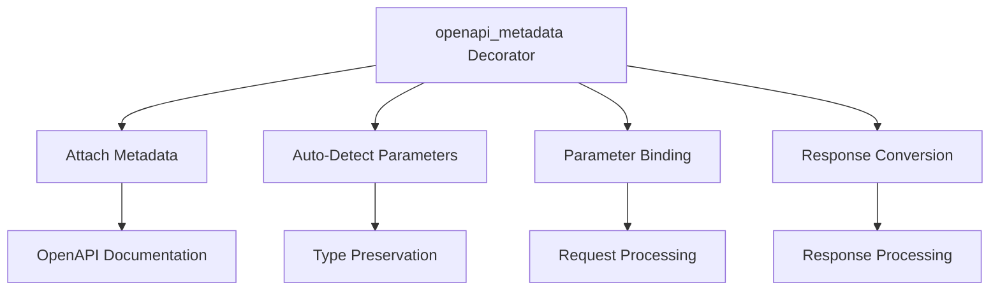
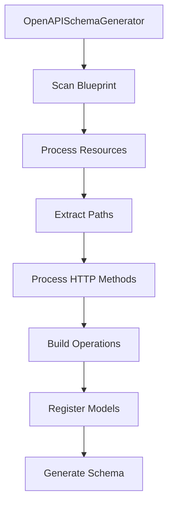
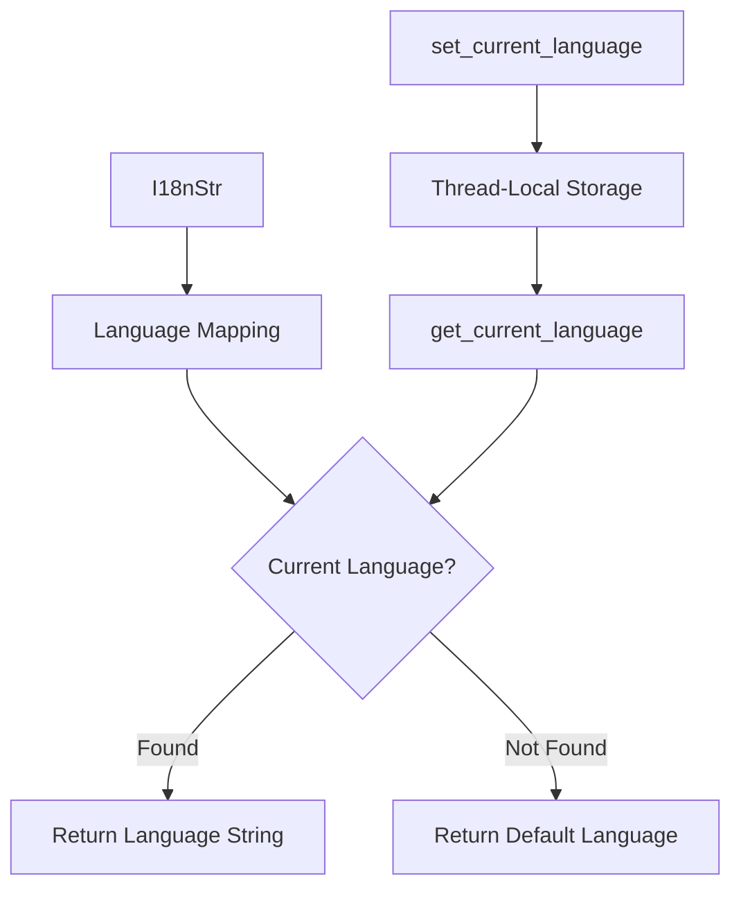
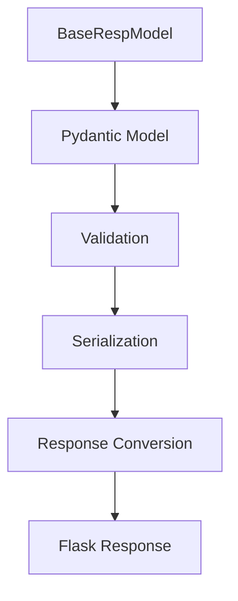
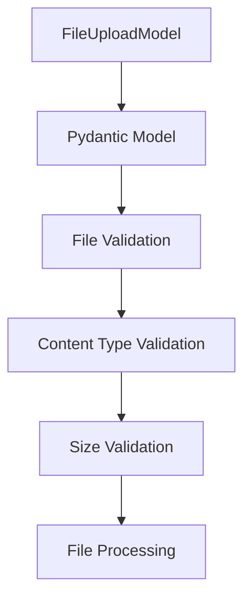
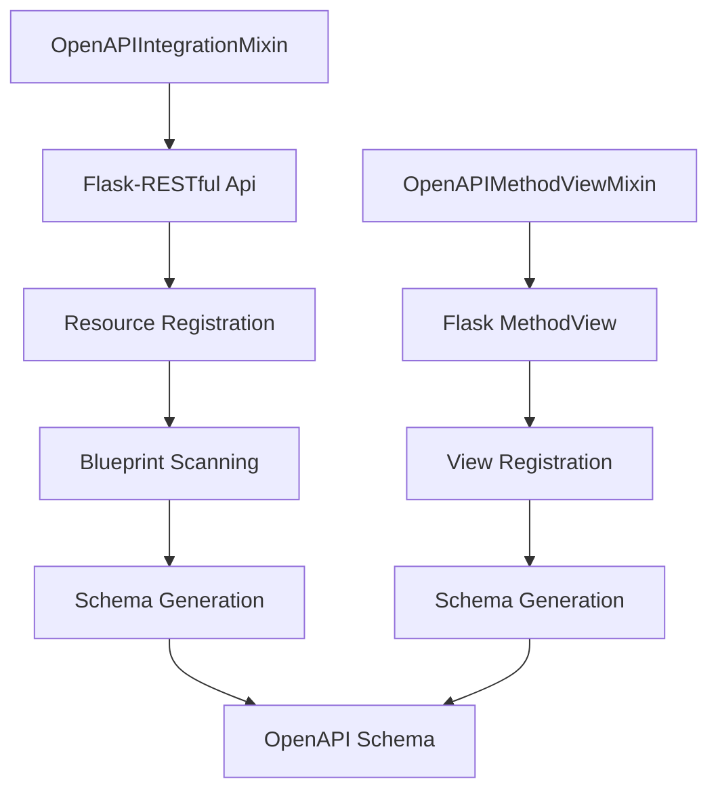
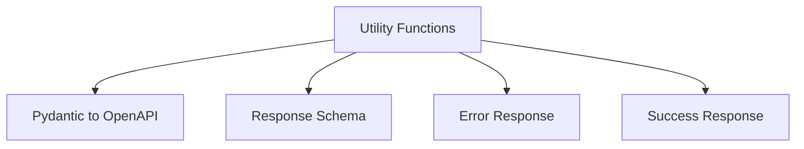
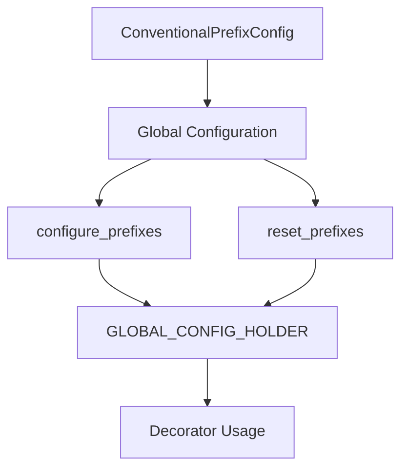
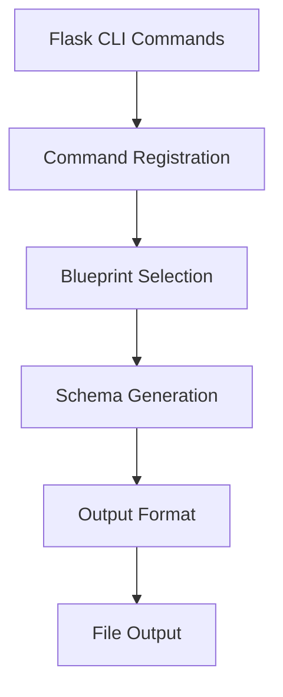
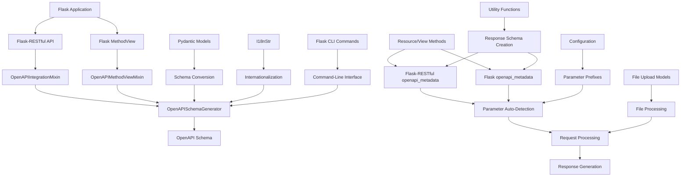

# Flask-X-OpenAPI-Schema Core Components

This document provides a detailed explanation of the core components of Flask-X-OpenAPI-Schema and how they work together.

## 1. OpenAPI Metadata Decorator

The `openapi_metadata` decorator is the primary entry point for adding OpenAPI metadata to API endpoints. There are two versions of this decorator: one for Flask.MethodView and one for Flask-RESTful. Both perform several key functions:



### How It Works

1. **Metadata Attachment**: The decorator attaches OpenAPI metadata to the function, which is later used by the schema generator.
2. **Parameter Auto-Detection**: It automatically detects parameters with special prefixes and their types.
3. **Parameter Binding**: It binds request parameters to function parameters based on their prefixes.
4. **Response Conversion**: It automatically converts `BaseRespModel` instances to Flask-RESTful compatible responses.

### Implementation Details

The decorator uses Python's introspection capabilities to examine the function signature and type annotations. It then creates a wrapper function that handles parameter binding and response conversion.

```python
# In flask_x_openapi_schema.x.flask.decorators
def openapi_metadata(
    *,
    summary: Optional[Union[str, I18nStr]] = None,
    description: Optional[Union[str, I18nStr]] = None,
    tags: Optional[list[str]] = None,
    operation_id: Optional[str] = None,
    prefix_config: Optional[ConventionalPrefixConfig] = None,
    # ... other parameters
):
    def decorator(func: F) -> F:
        # Examine function signature
        signature = inspect.signature(func)
        param_names = list(signature.parameters.keys())
        type_hints = get_type_hints(func)

        # Get prefix configuration
        config = prefix_config or GLOBAL_CONFIG_HOLDER.config

        # Auto-detect parameters
        # ...

        # Attach metadata to function
        func._openapi_metadata = metadata

        # Create wrapper function
        @wraps(func)
        def wrapper(*args, **kwargs):
            # Bind parameters
            # ...

            # Call original function
            result = func(*args, **kwargs)

            # Convert response
            # ...

            return result

        # Copy metadata to wrapper
        wrapper._openapi_metadata = metadata

        return wrapper

    return decorator

# Similar implementation in flask_x_openapi_schema.x.flask_restful.decorators
```

## 2. Schema Generator

The `OpenAPISchemaGenerator` class is responsible for generating OpenAPI schemas from Flask and Flask-RESTful resources.



### How It Works

1. **Initialization**: The generator is initialized with basic information about the API (title, version, description).
2. **Blueprint Scanning**: It scans Flask blueprints for API resources.
3. **Resource Processing**: It processes each resource and extracts its endpoints.
4. **Path Extraction**: It extracts paths from the resource URLs.
5. **Method Processing**: It processes HTTP methods for each path.
6. **Operation Building**: It builds OpenAPI operations from method metadata.
7. **Model Registration**: It registers Pydantic models in the components schemas.
8. **Schema Generation**: It generates the complete OpenAPI schema.

### Implementation Details

The generator uses Flask's routing system to extract paths and methods from resources. It then uses the metadata attached by the `openapi_metadata` decorator to build operations.

```python
class OpenAPISchemaGenerator:
    def __init__(self, title: str, version: str, description: str = "", language: Optional[str] = None):
        # Initialize generator
        # ...

    def scan_blueprint(self, blueprint: Blueprint) -> None:
        # Scan blueprint for resources
        # ...

    def _process_resource(self, resource: type[Resource], urls: tuple[str], prefix: Optional[str] = None) -> None:
        # Process resource and extract paths
        # ...

    def _build_operation_from_method(self, method: Any, resource_cls: type[Resource]) -> dict[str, Any]:
        # Build operation from method metadata
        # ...

    def _register_model(self, model: type[BaseModel]) -> None:
        # Register model in components schemas
        # ...

    def generate_schema(self) -> dict[str, Any]:
        # Generate complete OpenAPI schema
        # ...
```

## 3. Internationalization Support

The internationalization (i18n) support allows for multilingual API documentation.



### How It Works

1. **I18nStr**: The `I18nStr` class allows you to define strings in multiple languages.
2. **Language Mapping**: Strings are mapped to language codes.
3. **Current Language**: The current language is stored in thread-local storage.
4. **Language Selection**: When a string is requested, the appropriate language version is returned.

### Implementation Details

The i18n support uses Python's `contextvars` module to store the current language in thread-local storage. This allows different threads to use different languages simultaneously.

```python
# Thread-local storage for current language
_current_language = contextvars.ContextVar[str]("current_language", default="en-US")

def get_current_language() -> str:
    return _current_language.get()

def set_current_language(language: str) -> None:
    _current_language.set(language)

class I18nStr:
    def __init__(self, strings: Union[dict[str, str], str], default_language: str = "en-US"):
        # Initialize I18nStr
        if isinstance(strings, str):
            self.strings = {default_language: strings}
        else:
            self.strings = strings
        self.default_language = default_language

    def get(self, language: Optional[str] = None) -> str:
        # Get string in specified language
        language = language or get_current_language()
        return self.strings.get(language, self.strings.get(self.default_language, ""))

    def __str__(self) -> str:
        return self.get()
```

## 4. Response Models

The response models provide a way to define structured responses that are automatically converted to Flask-RESTful compatible responses.



### How It Works

1. **BaseRespModel**: The `BaseRespModel` class extends Pydantic's `BaseModel` to provide response conversion.
2. **Validation**: Pydantic validates the response data against the model schema.
3. **Serialization**: Pydantic serializes the model to a dictionary.
4. **Response Conversion**: The `to_response` method converts the model to a Flask-RESTful compatible response.

### Implementation Details

The `BaseRespModel` class provides a `to_response` method that converts the model to a Flask-RESTful compatible response. This method is called automatically by the `openapi_metadata` decorator when a `BaseRespModel` instance is returned from a resource method.

```python
class BaseRespModel(BaseModel):
    """Base model for API responses."""

    def to_response(self, status_code: int = 200) -> tuple:
        """Convert the model to a Flask-RESTful compatible response."""
        return self.model_dump(), status_code
```

## 5. File Upload Models

The file upload models provide a way to handle file uploads with validation.



### How It Works

1. **FileUploadModel**: The `FileUploadModel` class extends Pydantic's `BaseModel` to provide file upload handling.
2. **File Validation**: The model validates that a file is provided.
3. **Content Type Validation**: The model validates the file's content type.
4. **Size Validation**: The model validates the file's size.
5. **File Processing**: The model provides access to the file object for processing.

### Implementation Details

The file upload models use Pydantic's validation system to validate file uploads. They provide methods for checking file types, sizes, and other properties.

```python
class FileUploadModel(BaseModel):
    """Base model for file uploads."""

    file: FileStorage = Field(..., description="The uploaded file")

    def validate_file(self) -> None:
        """Validate the uploaded file."""
        if not self.file:
            raise ValueError("No file provided")

        # Additional validation can be added here

    class Config:
        arbitrary_types_allowed = True
```

## 6. Integration Mixins

The library provides several integration mixins for different frameworks:

1. **OpenAPIIntegrationMixin**: Integrates with Flask-RESTful's `Api` class
2. **OpenAPIBlueprintMixin**: Integrates with Flask's `Blueprint` class
3. **OpenAPIMethodViewMixin**: Integrates with Flask's `MethodView` class



### How They Work

#### OpenAPIIntegrationMixin
1. **Mixin**: The `OpenAPIIntegrationMixin` class is designed to be mixed in with Flask-RESTful's `Api` class.
2. **Resource Registration**: The mixin tracks resources as they are registered with the API.
3. **Blueprint Scanning**: The mixin provides methods for scanning blueprints for resources.
4. **Schema Generation**: The mixin provides methods for generating OpenAPI schemas from the registered resources.

#### OpenAPIMethodViewMixin
1. **Mixin**: The `OpenAPIMethodViewMixin` class is designed to be mixed in with Flask's `MethodView` class.
2. **Metadata Handling**: The mixin provides methods for handling OpenAPI metadata attached to view methods.
3. **Schema Generation**: The mixin provides methods for generating OpenAPI schemas from the view methods.

### Implementation Details

#### OpenAPIIntegrationMixin

The mixin extends Flask-RESTful's `Api` class to provide OpenAPI schema generation capabilities. It keeps track of resources and blueprints, and provides methods for generating schemas.

```python
class OpenAPIIntegrationMixin:
    """Mixin for integrating OpenAPI schema generation with Flask-RESTful."""

    def __init__(self, *args, **kwargs):
        super().__init__(*args, **kwargs)
        self.resources = []

    def add_resource(self, resource, *urls, **kwargs):
        # Track resources as they are registered
        self.resources.append((resource, urls, kwargs))
        return super().add_resource(resource, *urls, **kwargs)

    def generate_openapi_schema(self, title: str, version: str, description: str = "", output_format: str = "yaml") -> str:
        # Generate OpenAPI schema
        # ...
```

#### OpenAPIMethodViewMixin

The mixin extends Flask's `MethodView` class to provide OpenAPI schema generation capabilities. It extracts metadata from view methods and provides methods for generating schemas.

```python
class OpenAPIMethodViewMixin:
    """Mixin for integrating OpenAPI schema generation with Flask MethodView."""

    @classmethod
    def as_view(cls, name, *class_args, **class_kwargs):
        # Create a view function
        view = super().as_view(name, *class_args, **class_kwargs)

        # Attach OpenAPI metadata to the view function
        for method in cls.methods:
            if hasattr(cls, method.lower()):
                method_func = getattr(cls, method.lower())
                if hasattr(method_func, "_openapi_metadata"):
                    if not hasattr(view, "_openapi_metadata"):
                        view._openapi_metadata = {}
                    view._openapi_metadata[method.lower()] = method_func._openapi_metadata

        return view
```

## 7. Utility Functions

The utility functions provide helper methods for common tasks.



### How It Works

1. **Pydantic to OpenAPI**: Functions for converting Pydantic models to OpenAPI schemas.
2. **Response Schema**: Functions for creating response schemas.
3. **Error Response**: Functions for creating error response schemas.
4. **Success Response**: Functions for creating success response schemas.

### Implementation Details

The utility functions provide a convenient way to create common OpenAPI structures. They handle the details of converting Pydantic models to OpenAPI schemas and creating response schemas.

```python
def pydantic_to_openapi_schema(model: type[BaseModel]) -> dict[str, Any]:
    """Convert a Pydantic model to an OpenAPI schema."""
    # ...

def responses_schema(
    success_responses: Optional[dict[str, Any]] = None,
    errors: Optional[dict[str, Union[str, dict[str, Any]]]] = None,
) -> dict[str, Any]:
    """Create a responses schema for OpenAPI."""
    # ...

def success_response(
    model: Optional[type[BaseModel]] = None,
    description: str = "Successful response",
) -> dict[str, Any]:
    """Create a success response schema for OpenAPI."""
    # ...

def error_response_schema(description: str) -> dict[str, Any]:
    """Create an error response schema for OpenAPI."""
    # ...
```

## 8. Configuration

The library provides a configuration system for customizing parameter prefixes and other settings.



### How It Works

1. **ConventionalPrefixConfig**: A class for configuring parameter prefixes
2. **Global Configuration**: A global configuration holder for storing the current configuration
3. **Configuration Functions**: Functions for configuring and resetting the global configuration
4. **Usage in Decorators**: The configuration is used by the decorators to determine parameter prefixes

### Implementation Details

```python
class ConventionalPrefixConfig:
    """Configuration for conventional parameter prefixes."""

    def __init__(
        self,
        request_body_prefix: str = "_x_body",
        request_query_prefix: str = "_x_query",
        request_path_prefix: str = "_x_path",
        request_file_prefix: str = "_x_file",
    ):
        self.request_body_prefix = request_body_prefix
        self.request_query_prefix = request_query_prefix
        self.request_path_prefix = request_path_prefix
        self.request_file_prefix = request_file_prefix

class GlobalConfigHolder:
    """Global configuration holder."""

    def __init__(self):
        self.config = ConventionalPrefixConfig()

GLOBAL_CONFIG_HOLDER = GlobalConfigHolder()

def configure_prefixes(config: ConventionalPrefixConfig) -> None:
    """Configure global parameter prefixes."""
    GLOBAL_CONFIG_HOLDER.config = config

def reset_prefixes() -> None:
    """Reset global parameter prefixes to defaults."""
    GLOBAL_CONFIG_HOLDER.config = ConventionalPrefixConfig()
```

## 9. Flask CLI Commands

The Flask CLI commands provide a way to generate OpenAPI schemas from the command line.



### How It Works

1. **Command Registration**: The commands are registered with Flask's CLI system.
2. **Blueprint Selection**: The user selects a blueprint to generate a schema for.
3. **Schema Generation**: The schema is generated from the blueprint's resources.
4. **Output Format**: The schema is formatted as YAML or JSON.
5. **File Output**: The schema is written to a file.

### Implementation Details

The CLI commands use Flask's `click` library to define command-line interfaces. They provide options for selecting blueprints, output formats, and file paths.

```python
@click.command("generate-openapi")
@click.option("--blueprint", required=True, help="Blueprint to generate schema for")
@click.option("--output", required=True, help="Output file path")
@click.option("--format", default="yaml", type=click.Choice(["yaml", "json"]), help="Output format")
@with_appcontext
def generate_openapi_command(blueprint: str, output: str, format: str) -> None:
    """Generate OpenAPI schema for a blueprint."""
    # ...

def register_commands(app: Flask) -> None:
    """Register Flask CLI commands."""
    app.cli.add_command(generate_openapi_command)
```

## Component Interactions

The following diagram illustrates how the core components interact with each other:



## Conclusion

Flask-X-OpenAPI-Schema provides a comprehensive set of components for generating OpenAPI schemas from Flask and Flask-RESTful applications. These components work together to provide a seamless integration between Flask, Flask-RESTful, and Pydantic, allowing developers to create well-documented APIs with minimal effort. The modular design and framework-specific implementations make it easy to use with different Flask-based applications.