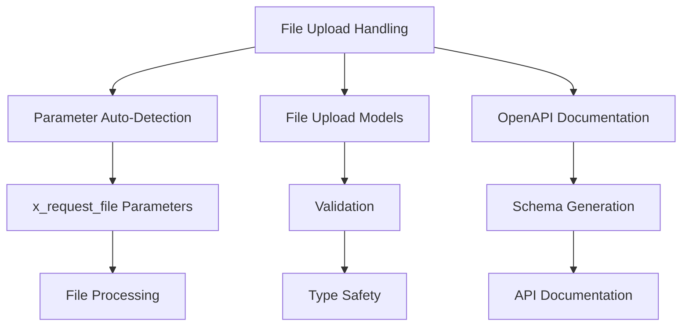
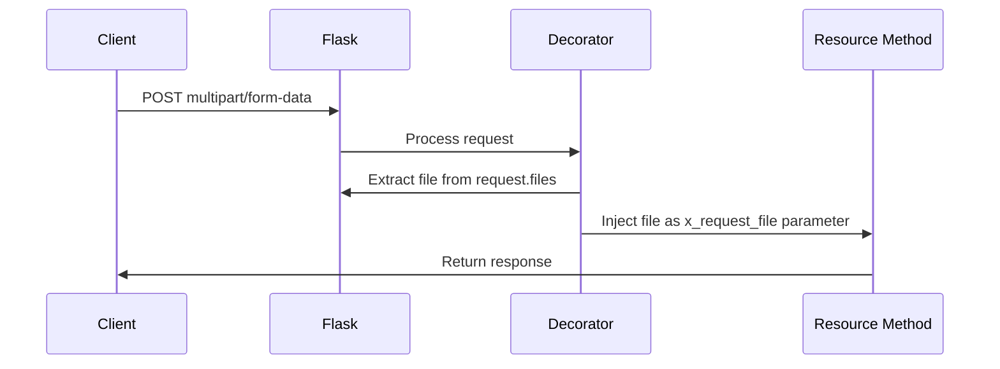
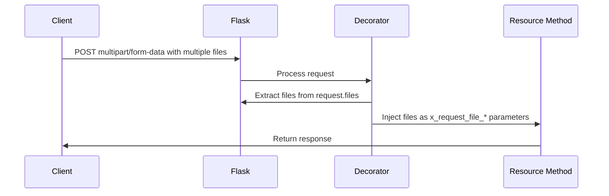
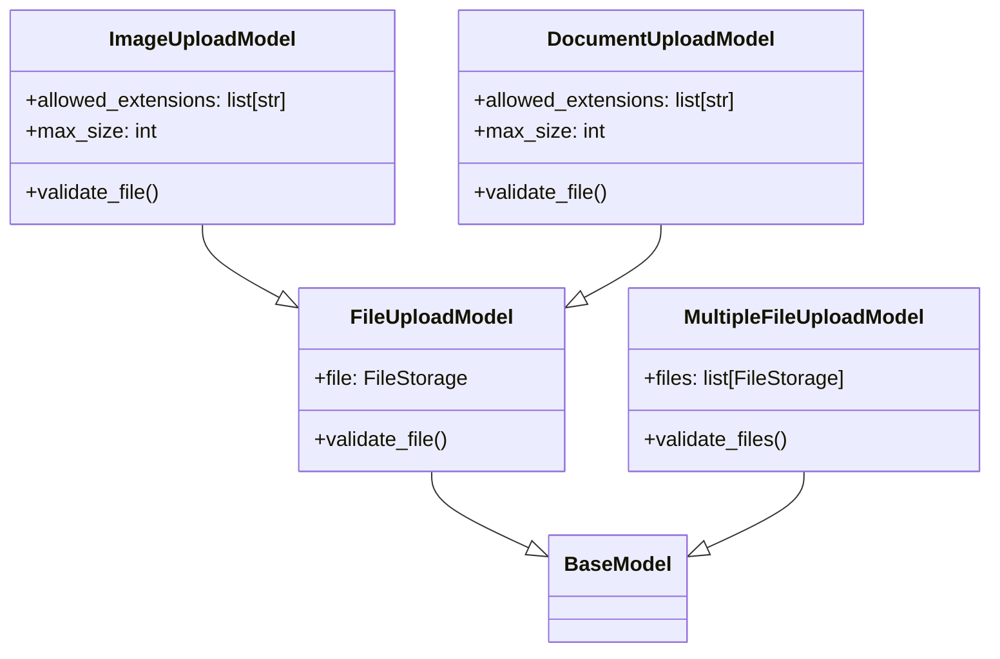

# File Upload Handling in Flask-X-OpenAPI-Schema

This document provides a detailed explanation of the file upload handling capabilities in Flask-X-OpenAPI-Schema and how to use them effectively.

## Overview

Flask-X-OpenAPI-Schema provides robust support for handling file uploads in Flask-RESTful APIs. It simplifies the process of receiving and processing uploaded files, while also providing validation and documentation through OpenAPI schemas.



## Basic File Upload

The simplest way to handle file uploads is to use the `x_request_file` parameter prefix with the `openapi_metadata` decorator.



### Example

```python
from flask_restful import Resource
from werkzeug.datastructures import FileStorage
from flask_x_openapi_schema.x.flask_restful import openapi_metadata

class FileUploadResource(Resource):
    @openapi_metadata(
        summary="Upload a file",
        description="Upload a file to the server",
        tags=["Files"],
        operation_id="uploadFile",
    )
    def post(self, x_request_file: FileStorage):
        """
        Upload a file to the server.

        This endpoint accepts a file upload and returns information about the uploaded file.
        The file is automatically injected into the method via the x_request_file parameter.
        """
        if not x_request_file:
            return {"error": "No file provided"}, 400

        # Process the uploaded file
        filename = x_request_file.filename
        content_type = x_request_file.content_type

        # Read the file content
        file_content = x_request_file.read()
        file_size = len(file_content)

        # Return information about the uploaded file
        return {
            "filename": filename,
            "size": file_size,
            "content_type": content_type,
        }
```

## Multiple File Uploads

You can handle multiple file uploads by using multiple parameters with the `x_request_file` prefix followed by the file name.



### Example

```python
from flask_restful import Resource
from werkzeug.datastructures import FileStorage
from flask_x_openapi_schema.x.flask_restful import openapi_metadata

class MultipleFileUploadResource(Resource):
    @openapi_metadata(
        summary="Upload multiple files",
        description="Upload multiple files to the server",
        tags=["Files"],
        operation_id="uploadMultipleFiles",
    )
    def post(self, x_request_file_document: FileStorage, x_request_file_image: FileStorage):
        """
        Upload multiple files to the server.

        This endpoint accepts multiple file uploads and returns information about the uploaded files.
        The files are automatically injected into the method via the x_request_file_* parameters.
        """
        files_info = []

        # Process the document file
        if x_request_file_document:
            filename = x_request_file_document.filename
            content_type = x_request_file_document.content_type
            file_content = x_request_file_document.read()
            file_size = len(file_content)

            files_info.append({
                "filename": filename,
                "size": file_size,
                "content_type": content_type,
                "type": "document",
            })

        # Process the image file
        if x_request_file_image:
            filename = x_request_file_image.filename
            content_type = x_request_file_image.content_type
            file_content = x_request_file_image.read()
            file_size = len(file_content)

            files_info.append({
                "filename": filename,
                "size": file_size,
                "content_type": content_type,
                "type": "image",
            })

        if not files_info:
            return {"error": "No files provided"}, 400

        # Return information about the uploaded files
        return {"files": files_info}
```

## File Upload Models

For better type checking, validation, and IDE support, Flask-X-OpenAPI-Schema provides Pydantic models for file uploads.



### Built-in Models

Flask-X-OpenAPI-Schema provides several built-in models for common file upload scenarios:

1. **FileUploadModel**: Base model for file uploads
2. **ImageUploadModel**: Model for image file uploads with validation
3. **DocumentUploadModel**: Model for document file uploads with validation
4. **MultipleFileUploadModel**: Model for multiple file uploads

### Example

```python
from flask_restful import Resource
from flask_x_openapi_schema.x.flask_restful import openapi_metadata
from flask_x_openapi_schema import ImageUploadModel

class ImageUploadResource(Resource):
    @openapi_metadata(
        summary="Upload an image",
        description="Upload an image with validation",
        tags=["Images"],
        operation_id="uploadImage",
    )
    def post(self, x_request_file: ImageUploadModel):
        """
        Upload an image to the server.

        This endpoint accepts an image upload and returns information about the uploaded image.
        The image is automatically injected into the method via the x_request_file parameter.
        The image is validated to ensure it's a valid image file.
        """
        # The file is automatically injected and validated
        file = x_request_file.file

        # Process the file
        filename = file.filename
        content_type = file.content_type
        file_content = file.read()
        file_size = len(file_content)

        # Return information about the uploaded file
        return {
            "filename": filename,
            "size": file_size,
            "content_type": content_type,
        }
```

## Custom Validation

You can create custom file upload models with specific validation requirements:

```python
from flask_x_openapi_schema.models import FileUploadModel
from pydantic import Field, validator
from werkzeug.datastructures import FileStorage

class PDFUploadModel(FileUploadModel):
    """Model for PDF file uploads."""

    file: FileStorage = Field(..., description="The PDF file to upload")

    @validator("file")
    def validate_pdf(cls, file):
        """Validate that the file is a PDF."""
        if not file:
            raise ValueError("No file provided")

        # Check file extension
        if not file.filename.lower().endswith(".pdf"):
            raise ValueError("File must be a PDF")

        # Check content type
        if file.content_type != "application/pdf":
            raise ValueError("File must be a PDF")

        # Check file size (max 10MB)
        file.seek(0, 2)  # Seek to the end of the file
        file_size = file.tell()  # Get the position (size)
        file.seek(0)  # Rewind to the beginning

        if file_size > 10 * 1024 * 1024:  # 10MB
            raise ValueError("File size must be less than 10MB")

        return file
```

## OpenAPI Documentation

Flask-X-OpenAPI-Schema automatically generates OpenAPI documentation for file upload endpoints:

```yaml
paths:
  /upload:
    post:
      summary: Upload a file
      description: Upload a file to the server
      tags:
        - Files
      operationId: uploadFile
      consumes:
        - multipart/form-data
      parameters:
        - name: file
          in: formData
          required: true
          type: file
          description: File upload for file
      responses:
        '200':
          description: File uploaded successfully
          content:
            application/json:
              schema:
                type: object
                properties:
                  filename:
                    type: string
                  size:
                    type: integer
                  content_type:
                    type: string
        '400':
          description: No file provided
```

## Client-Side Implementation

Here's an example of how to upload files to your API from a client:

### HTML Form

```html
<form action="/upload" method="post" enctype="multipart/form-data">
  <input type="file" name="file">
  <button type="submit">Upload</button>
</form>
```

### JavaScript (Fetch API)

```javascript
async function uploadFile(file) {
  const formData = new FormData();
  formData.append('file', file);

  const response = await fetch('/upload', {
    method: 'POST',
    body: formData,
  });

  return response.json();
}

// Usage
const fileInput = document.querySelector('input[type="file"]');
const file = fileInput.files[0];
uploadFile(file).then(result => {
  console.log(result);
});
```

### Python (Requests)

```python
import requests

def upload_file(file_path):
    with open(file_path, 'rb') as f:
        files = {'file': f}
        response = requests.post('http://localhost:5000/upload', files=files)

    return response.json()

# Usage
result = upload_file('example.pdf')
print(result)
```

## Advanced Techniques

### 1. File Processing with Context Managers

Use context managers to ensure proper file handling:

```python
def process_file(file):
    """Process an uploaded file."""
    with tempfile.NamedTemporaryFile(delete=False) as temp:
        # Save the file to a temporary location
        file.save(temp.name)

        # Process the file
        # ...

        # Return the result
        return {
            "filename": file.filename,
            "size": os.path.getsize(temp.name),
            "content_type": file.content_type,
        }
```

### 2. Streaming Large Files

For large files, use streaming to avoid loading the entire file into memory:

```python
def stream_large_file(file):
    """Stream a large file to another location."""
    chunk_size = 4096  # 4KB chunks

    with open('destination.file', 'wb') as f:
        # Read and write in chunks
        chunk = file.read(chunk_size)
        while chunk:
            f.write(chunk)
            chunk = file.read(chunk_size)
```

### 3. Background Processing

For time-consuming file processing, use background tasks:

```python
from celery import Celery

# Configure Celery
celery = Celery('tasks', broker='redis://localhost:6379/0')

@celery.task
def process_file_task(file_path):
    """Process a file in the background."""
    # Process the file
    # ...
    return {"status": "completed"}

def upload_and_process(file):
    """Upload a file and process it in the background."""
    # Save the file to a temporary location
    temp_path = f"/tmp/{secure_filename(file.filename)}"
    file.save(temp_path)

    # Start background processing
    task = process_file_task.delay(temp_path)

    # Return the task ID
    return {"task_id": task.id}
```

## Best Practices

### 1. Always Validate Files

Always validate uploaded files to prevent security issues:

```python
def validate_file(file):
    """Validate an uploaded file."""
    # Check if a file was provided
    if not file:
        return False, "No file provided"

    # Check file extension
    allowed_extensions = {'.jpg', '.jpeg', '.png', '.gif'}
    ext = os.path.splitext(file.filename)[1].lower()
    if ext not in allowed_extensions:
        return False, f"File extension {ext} not allowed"

    # Check content type
    allowed_content_types = {'image/jpeg', 'image/png', 'image/gif'}
    if file.content_type not in allowed_content_types:
        return False, f"Content type {file.content_type} not allowed"

    # Check file size
    file.seek(0, 2)
    size = file.tell()
    file.seek(0)
    if size > 5 * 1024 * 1024:  # 5MB
        return False, "File too large (max 5MB)"

    return True, "File is valid"
```

### 2. Use Secure Filenames

Always use secure filenames to prevent path traversal attacks:

```python
from werkzeug.utils import secure_filename

def save_file(file):
    """Save an uploaded file with a secure filename."""
    filename = secure_filename(file.filename)
    file.save(os.path.join('uploads', filename))
    return filename
```

### 3. Store Files Outside the Web Root

Store uploaded files outside the web root to prevent direct access:

```python
UPLOAD_FOLDER = '/var/uploads'  # Outside web root

def save_file(file):
    """Save an uploaded file outside the web root."""
    filename = secure_filename(file.filename)
    file.save(os.path.join(UPLOAD_FOLDER, filename))
    return filename
```

### 4. Use Content Type Verification

Verify the content type of uploaded files to prevent MIME type spoofing:

```python
import magic

def verify_content_type(file):
    """Verify the content type of an uploaded file."""
    # Read the first 2048 bytes
    header = file.read(2048)
    file.seek(0)

    # Use python-magic to detect the content type
    mime = magic.Magic(mime=True)
    detected_type = mime.from_buffer(header)

    # Compare with the declared content type
    if detected_type != file.content_type:
        return False, f"Content type mismatch: declared {file.content_type}, detected {detected_type}"

    return True, "Content type verified"
```

### 5. Implement Rate Limiting

Implement rate limiting to prevent abuse:

```python
from flask_limiter import Limiter
from flask_limiter.util import get_remote_address

limiter = Limiter(
    app,
    key_func=get_remote_address,
    default_limits=["200 per day", "50 per hour"]
)

@app.route('/upload', methods=['POST'])
@limiter.limit("10 per minute")
def upload_file():
    # Handle file upload
    # ...
```

## Conclusion

Flask-X-OpenAPI-Schema provides comprehensive support for handling file uploads in Flask-RESTful APIs. By using the `x_request_file` parameter prefix and the built-in file upload models, you can easily implement file upload functionality with proper validation and documentation. The automatic OpenAPI schema generation ensures that your API documentation is always up-to-date with your implementation.