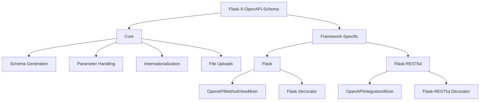

# Framework-Specific Implementations

Flask-X-OpenAPI-Schema provides separate implementations for different Flask-based frameworks. This allows you to use the library with your preferred framework while maintaining a consistent API.

## Overview



## Flask Implementation

The Flask implementation is designed to work with Flask's `MethodView` classes and blueprints.

### Import Paths

```python
from flask_x_openapi_schema.x.flask import openapi_metadata, OpenAPIMethodViewMixin
```

### OpenAPIMethodViewMixin

The `OpenAPIMethodViewMixin` class is designed to be mixed in with Flask's `MethodView` class. It provides methods for handling OpenAPI metadata attached to view methods.

```python
from flask import Flask, Blueprint
from flask.views import MethodView
from flask_x_openapi_schema.x.flask import OpenAPIMethodViewMixin, openapi_metadata
from pydantic import BaseModel, Field

# Define a model
class ItemModel(BaseModel):
    name: str = Field(..., description="Item name")
    price: float = Field(..., description="Item price")

# Create a view with OpenAPI metadata
class ItemView(OpenAPIMethodViewMixin, MethodView):
    @openapi_metadata(
        summary="Get an item",
        tags=["Items"],
        operation_id="getItem"
    )
    def get(self, item_id: str):
        # ...
        return {"id": item_id, "name": "Example", "price": 10.99}
    
    @openapi_metadata(
        summary="Create an item",
        tags=["Items"],
        operation_id="createItem"
    )
    def post(self, x_request_body: ItemModel):
        # ...
        return {"id": "123", "name": x_request_body.name, "price": x_request_body.price}, 201

# Register the view
blueprint = Blueprint("api", __name__)
blueprint.add_url_rule("/items/<item_id>", view_func=ItemView.as_view("item"))
blueprint.add_url_rule("/items", view_func=ItemView.as_view("items"))
```

### Schema Generation

To generate an OpenAPI schema from Flask views, use the `OpenAPISchemaGenerator` class:

```python
from flask_x_openapi_schema import OpenAPISchemaGenerator

# Create a schema generator
generator = OpenAPISchemaGenerator(
    title="Items API",
    version="1.0.0",
    description="API for managing items"
)

# Scan the blueprint
generator.scan_blueprint(blueprint)

# Generate the schema
schema = generator.generate_schema()

# Convert to YAML or JSON
import yaml
with open("openapi.yaml", "w") as f:
    yaml.dump(schema, f)
```

## Flask-RESTful Implementation

The Flask-RESTful implementation is designed to work with Flask-RESTful's `Resource` classes and `Api` instances.

### Import Paths

```python
from flask_x_openapi_schema.x.flask_restful import openapi_metadata, OpenAPIIntegrationMixin
```

### OpenAPIIntegrationMixin

The `OpenAPIIntegrationMixin` class is designed to be mixed in with Flask-RESTful's `Api` class. It provides methods for generating OpenAPI schemas from registered resources.

```python
from flask import Flask
from flask_restful import Resource, Api
from flask_x_openapi_schema.x.flask_restful import OpenAPIIntegrationMixin, openapi_metadata
from pydantic import BaseModel, Field

# Define a model
class ItemModel(BaseModel):
    name: str = Field(..., description="Item name")
    price: float = Field(..., description="Item price")

# Create a Flask app
app = Flask(__name__)

# Create an OpenAPI-enabled API
class OpenAPIApi(OpenAPIIntegrationMixin, Api):
    pass

# Initialize the API
api = OpenAPIApi(app)

# Create a resource with OpenAPI metadata
class ItemResource(Resource):
    @openapi_metadata(
        summary="Get an item",
        tags=["Items"],
        operation_id="getItem"
    )
    def get(self, item_id: str):
        # ...
        return {"id": item_id, "name": "Example", "price": 10.99}
    
    @openapi_metadata(
        summary="Create an item",
        tags=["Items"],
        operation_id="createItem"
    )
    def post(self, x_request_body: ItemModel):
        # ...
        return {"id": "123", "name": x_request_body.name, "price": x_request_body.price}, 201

# Register the resource
api.add_resource(ItemResource, "/items", "/items/<item_id>")
```

### Schema Generation

To generate an OpenAPI schema from Flask-RESTful resources, use the `generate_openapi_schema` method of the `OpenAPIIntegrationMixin` class:

```python
# Generate OpenAPI schema
schema = api.generate_openapi_schema(
    title="Items API",
    version="1.0.0",
    description="API for managing items",
    output_format="yaml"  # or "json"
)

# Save the schema to a file
with open("openapi.yaml", "w") as f:
    f.write(schema)
```

## Choosing the Right Implementation

Choose the implementation that best fits your project:

- **Flask Implementation**: Use this if you're using Flask's `MethodView` classes or blueprints.
- **Flask-RESTful Implementation**: Use this if you're using Flask-RESTful's `Resource` classes and `Api` instances.

Both implementations provide the same core functionality, including:

- Parameter auto-detection
- Request validation
- Response generation
- OpenAPI schema generation
- Internationalization support
- File upload support

## Using Both Implementations

You can use both implementations in the same project if needed:

```python
from flask import Flask, Blueprint
from flask.views import MethodView
from flask_restful import Resource, Api
from flask_x_openapi_schema.x.flask import openapi_metadata as flask_openapi_metadata, OpenAPIMethodViewMixin
from flask_x_openapi_schema.x.flask_restful import openapi_metadata as restful_openapi_metadata, OpenAPIIntegrationMixin

# Create a Flask app
app = Flask(__name__)

# Create a blueprint
blueprint = Blueprint("api", __name__)

# Create an OpenAPI-enabled API
class OpenAPIApi(OpenAPIIntegrationMixin, Api):
    pass

# Initialize the API
api = OpenAPIApi(app)

# Create a Flask.MethodView with OpenAPI metadata
class ItemView(OpenAPIMethodViewMixin, MethodView):
    @flask_openapi_metadata(
        summary="Get an item",
        tags=["Items"],
        operation_id="getItem"
    )
    def get(self, item_id: str):
        # ...
        return {"id": item_id, "name": "Example", "price": 10.99}

# Register the view
blueprint.add_url_rule("/items/<item_id>", view_func=ItemView.as_view("item"))
app.register_blueprint(blueprint)

# Create a Flask-RESTful resource with OpenAPI metadata
class ItemResource(Resource):
    @restful_openapi_metadata(
        summary="Create an item",
        tags=["Items"],
        operation_id="createItem"
    )
    def post(self, x_request_body: ItemModel):
        # ...
        return {"id": "123", "name": x_request_body.name, "price": x_request_body.price}, 201

# Register the resource
api.add_resource(ItemResource, "/items")
```

## Best Practices

1. **Consistent Imports**: Use explicit imports from the specific modules to avoid confusion:
   ```python
   # Good
   from flask_x_openapi_schema.x.flask import openapi_metadata
   
   # Avoid
   from flask_x_openapi_schema import openapi_metadata
   ```

2. **Consistent Naming**: Use the same decorator name (`openapi_metadata`) for both implementations to maintain consistency.

3. **Framework-Specific Mixins**: Use the appropriate mixin for your framework:
   - `OpenAPIMethodViewMixin` for Flask's `MethodView`
   - `OpenAPIIntegrationMixin` for Flask-RESTful's `Api`

4. **Schema Generation**: Use the appropriate method for generating schemas:
   - `OpenAPISchemaGenerator` for Flask views
   - `generate_openapi_schema` method for Flask-RESTful resources