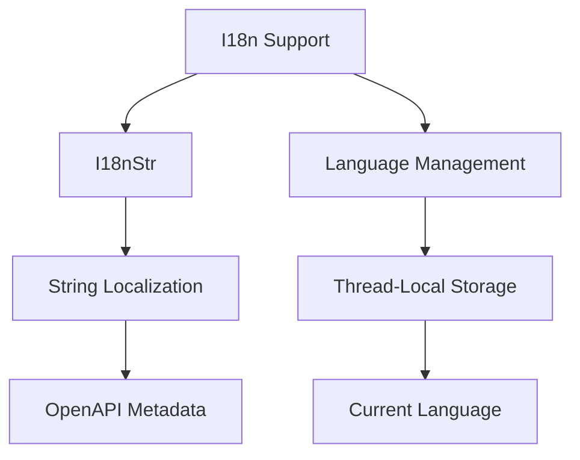
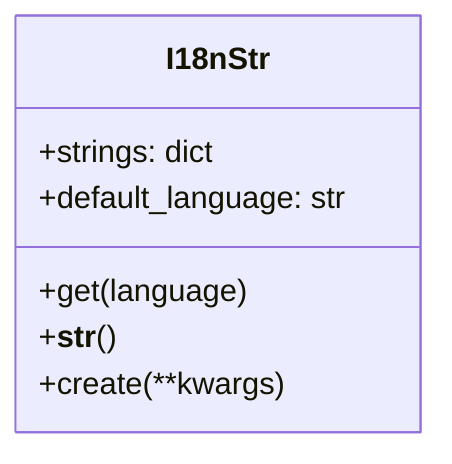
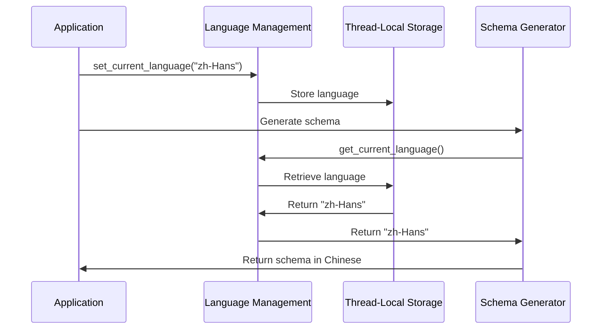
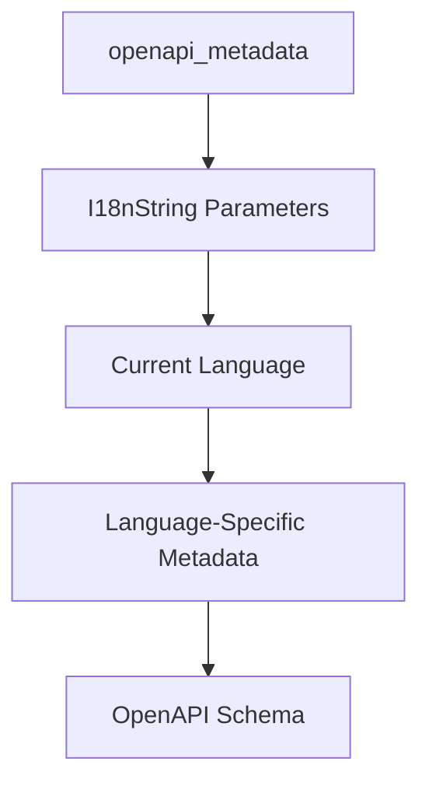
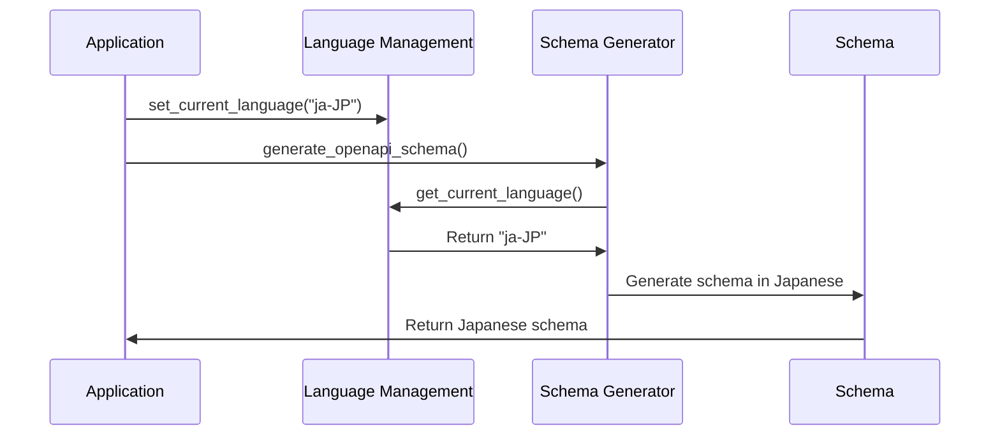

# Internationalization (i18n) Support in Flask-X-OpenAPI-Schema

This document provides a detailed explanation of the internationalization (i18n) support in Flask-X-OpenAPI-Schema and how to use it effectively.

## Overview

Flask-X-OpenAPI-Schema provides robust support for internationalization in API documentation. This allows you to create API documentation in multiple languages, making your API more accessible to users around the world.



## Core Components

### 1. I18nStr

The `I18nStr` class is the foundation of i18n support in Flask-X-OpenAPI-Schema. It allows you to define strings in multiple languages and automatically returns the appropriate string based on the current language setting.



#### Usage

```python
from flask_x_openapi_schema import I18nStr

# Create an I18nStr with multiple language versions
greeting = I18nStr({
    "en-US": "Hello",
    "zh-Hans": "你好",
    "ja-JP": "こんにちは"
})

# Get the string in the current language
print(str(greeting))  # Outputs the greeting in the current language

# Get the string in a specific language
print(greeting.get("zh-Hans"))  # Outputs "你好"

# Alternative creation method with keyword arguments
greeting = I18nStr.create(
    en_US="Hello",
    zh_Hans="你好",
    ja_JP="こんにちは"
)
```

### 2. Language Management

Flask-X-OpenAPI-Schema provides functions for managing the current language setting. These functions use Python's `contextvars` module to store the current language in thread-local storage, allowing different threads to use different languages simultaneously.



#### Usage

```python
from flask_x_openapi_schema import set_current_language, get_current_language

# Set the current language
set_current_language("zh-Hans")

# Get the current language
current_lang = get_current_language()  # Returns "zh-Hans"
```

## Integration with OpenAPI Metadata

The i18n support is fully integrated with the `openapi_metadata` decorator, allowing you to define internationalized metadata for your API endpoints.



### Usage

```python
from flask_x_openapi_schema.x.flask_restful import openapi_metadata
from flask_x_openapi_schema import I18nStr, set_current_language

# Set the current language for schema generation
set_current_language("zh-Hans")

@openapi_metadata(
    summary=I18nStr({
        "en-US": "Get an item",
        "zh-Hans": "获取一个项目",
        "ja-JP": "アイテムを取得する",
    }),
    description=I18nStr({
        "en-US": "Get an item by ID from the database",
        "zh-Hans": "通过ID从数据库获取一个项目",
        "ja-JP": "IDからデータベースからアイテムを取得する",
    }),
    tags=["Items"],
    operation_id="getItem",
)
def get(self, item_id: str):
    # ...
```

## Integration with Schema Generation

The i18n support is also integrated with the schema generation process, allowing you to generate OpenAPI schemas in different languages.



### Usage

```python
from flask_x_openapi_schema import set_current_language
from flask_x_openapi_schema.x.flask_restful import OpenAPIIntegrationMixin
from flask import Flask
from flask_restful import Api

# Create a Flask app
app = Flask(__name__)

# Create an OpenAPI-enabled API
class OpenAPIApi(OpenAPIIntegrationMixin, Api):
    pass

# Initialize the API
api = OpenAPIApi(app)

# Register resources
# ...

# Set the language for schema generation
set_current_language("zh-Hans")

# Generate OpenAPI schema in Chinese
schema = api.generate_openapi_schema(
    title="Items API",
    version="1.0.0",
    description="API for managing items",
    output_format="yaml",
)
```

## Supported Languages

Flask-X-OpenAPI-Schema supports a wide range of languages out of the box:

```python
SUPPORTED_LANGUAGES = [
    "en-US",    # English (United States)
    "zh-Hans",  # Chinese (Simplified)
    "zh-Hant",  # Chinese (Traditional)
    "pt-BR",    # Portuguese (Brazil)
    "es-ES",    # Spanish (Spain)
    "fr-FR",    # French (France)
    "de-DE",    # German (Germany)
    "ja-JP",    # Japanese (Japan)
    "ko-KR",    # Korean (Korea)
    "ru-RU",    # Russian (Russia)
    "it-IT",    # Italian (Italy)
    "uk-UA",    # Ukrainian (Ukraine)
    "vi-VN",    # Vietnamese (Vietnam)
    "ro-RO",    # Romanian (Romania)
    "pl-PL",    # Polish (Poland)
    "hi-IN",    # Hindi (India)
    "tr-TR",    # Turkish (Turkey)
    "fa-IR",    # Persian (Iran)
    "sl-SI",    # Slovenian (Slovenia)
    "th-TH",    # Thai (Thailand)
]
```

You can add support for additional languages by including them in your `I18nString` instances.

## Advanced Usage

### 1. Default Language Fallback

If a string is not available in the requested language, `I18nString` will fall back to the default language (usually "en-US"):

```python
greeting = I18nString({
    "en-US": "Hello",
    "zh-Hans": "你好",
})

# Get the string in a language that's not available
print(greeting.get("fr-FR"))  # Falls back to "Hello"
```

### 2. Custom Default Language

You can specify a custom default language when creating an `I18nString`:

```python
greeting = I18nString({
    "zh-Hans": "你好",
    "ja-JP": "こんにちは"
}, default_language="zh-Hans")

# Get the string in a language that's not available
print(greeting.get("fr-FR"))  # Falls back to "你好"
```

### 3. Single String for All Languages

If you provide a single string instead of a dictionary, it will be used for all languages:

```python
greeting = I18nString("Hello")

# Get the string in any language
print(greeting.get("zh-Hans"))  # Returns "Hello"
print(greeting.get("ja-JP"))    # Returns "Hello"
```

### 4. Single String for All Languages

If you provide a single string instead of a dictionary, it will be used for all languages:

```python
greeting = I18nStr("Hello")

# Get the string in any language
print(greeting.get("zh-Hans"))  # Returns "Hello"
print(greeting.get("ja-JP"))    # Returns "Hello"
```

### 5. Context-Based Language Switching

You can use Python's context managers to temporarily switch languages:

```python
import contextlib
from flask_x_openapi_schema import set_current_language, get_current_language

@contextlib.contextmanager
def language_context(language):
    """Temporarily switch to a different language."""
    previous_language = get_current_language()
    set_current_language(language)
    try:
        yield
    finally:
        set_current_language(previous_language)

# Use the context manager
with language_context("zh-Hans"):
    # Generate schema in Chinese
    schema_zh = api.generate_openapi_schema(...)

with language_context("ja-JP"):
    # Generate schema in Japanese
    schema_ja = api.generate_openapi_schema(...)
```

## Best Practices

### 1. Consistent Language Codes

Use consistent language codes throughout your application. Flask-X-OpenAPI-Schema uses BCP 47 language tags (e.g., "en-US", "zh-Hans") by default.

### 2. Complete Language Coverage

Ensure that all strings have translations for all supported languages. Missing translations will fall back to the default language, which may not be ideal for users.

### 3. Descriptive Keys

Use descriptive keys for your translations to make them easier to maintain:

```python
# Good
error_messages = {
    "item_not_found": I18nString({
        "en-US": "Item not found",
        "zh-Hans": "未找到项目",
        "ja-JP": "アイテムが見つかりません",
    }),
    "invalid_request": I18nString({
        "en-US": "Invalid request",
        "zh-Hans": "无效的请求",
        "ja-JP": "無効なリクエスト",
    }),
}

# Bad
error_messages = {
    "e1": I18nString({
        "en-US": "Item not found",
        "zh-Hans": "未找到项目",
        "ja-JP": "アイテムが見つかりません",
    }),
    "e2": I18nString({
        "en-US": "Invalid request",
        "zh-Hans": "无效的请求",
        "ja-JP": "無効なリクエスト",
    }),
}
```

### 4. Centralized String Management

Consider centralizing your internationalized strings in a separate module to make them easier to manage:

```python
# strings.py
from flask_x_openapi_schema import I18nString

# Common strings
COMMON = {
    "success": I18nString({
        "en-US": "Success",
        "zh-Hans": "成功",
        "ja-JP": "成功",
    }),
    "error": I18nString({
        "en-US": "Error",
        "zh-Hans": "错误",
        "ja-JP": "エラー",
    }),
}

# Item-related strings
ITEMS = {
    "item_not_found": I18nString({
        "en-US": "Item not found",
        "zh-Hans": "未找到项目",
        "ja-JP": "アイテムが見つかりません",
    }),
    "item_created": I18nString({
        "en-US": "Item created successfully",
        "zh-Hans": "项目创建成功",
        "ja-JP": "アイテムが正常に作成されました",
    }),
}
```

### 5. Language Detection

Consider implementing language detection based on the user's preferences:

```python
from flask import request
from flask_x_openapi_schema import set_current_language

@app.before_request
def set_language():
    """Set the current language based on the Accept-Language header."""
    accept_language = request.headers.get("Accept-Language", "en-US")
    # Parse the Accept-Language header to get the preferred language
    # This is a simplified example; in practice, you would use a proper parser
    preferred_language = accept_language.split(",")[0].split(";")[0]
    set_current_language(preferred_language)
```

## Conclusion

Flask-X-OpenAPI-Schema provides comprehensive support for internationalization in API documentation. By using `I18nString` and `I18nBaseModel`, you can create multilingual API documentation that is accessible to users around the world. The thread-local storage for the current language allows different parts of your application to use different languages simultaneously, making it easy to support multiple languages in a single application.